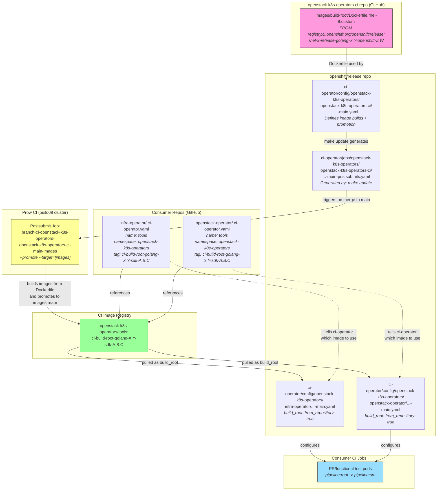

# CI Image Build and Promotion Flow

This document describes how CI build root images are built, promoted, and consumed
by openstack-k8s-operators repos.

## Key Flow

1. **PR merged** to `openstack-k8s-operators-ci` main branch
2. **Postsubmit job** (`branch-ci-openstack-k8s-operators-openstack-k8s-operators-ci-main-images`) triggers on the `build08` cluster, builds images from `Dockerfile.rhel-9.custom`
3. **Promotion** pushes the built image to the `openstack-k8s-operators/tools` imagestream (e.g. tag `ci-build-root-golang-1.24-sdk-1.41.1`)
4. **Consumer repos** (infra-operator, openstack-operator, etc.) reference that tag in their `.ci-operator.yaml` via `build_root_image`
5. **ci-operator** reads `build_root: from_repository: true` in the openshift/release config, looks up `.ci-operator.yaml` in the consumer repo, and pulls the referenced image as the build root
6. **Test pods** (functional, precommit, etc.) run using that build root as the `src` base image

## Important Notes

- The Go version in the build root is determined by the `FROM` base image in `Dockerfile.rhel-9.custom`, not by the image tag name
- Until the postsubmit promotion job completes successfully, all consumer repos continue using the previous version of the image
- The postsubmit job status can be checked at: `https://prow.ci.openshift.org/?job=branch-ci-openstack-k8s-operators-openstack-k8s-operators-ci-main-images`
